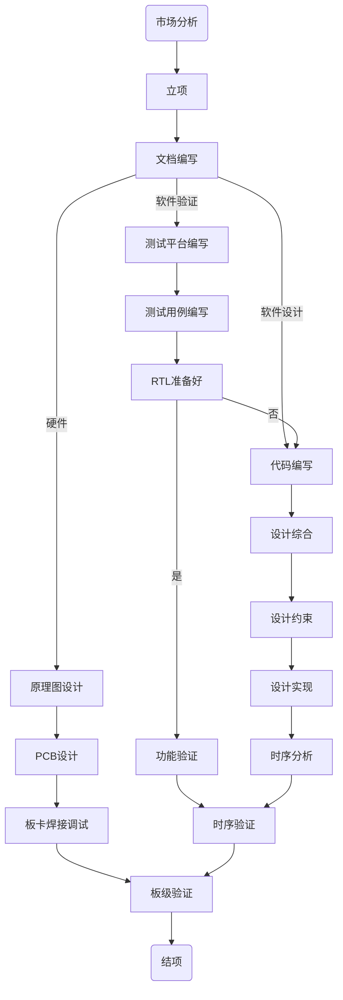

# 第一章 FPGA简介

## 什么是FPGA？
不用去百度FPGA，你只需要记住FPGA是什么的缩写，那么就可以大概知道什么是FPGA了。FPGA的全称是Filed-Programming-Gate-Array，翻译过来是现场可编程-门阵列。它的结构是门阵列，也就是基础的构成是一堆门，它的特性是现场可编程，所有现场可编程，意思就是你可以根据你的设计需求，随时对FPGA内运行的程序逻辑进行修改，它不是一次性编程，也不是固定死的逻辑，这个就区别于ASIC芯片。
ASIC芯片为专用集成电路，芯片设计好之后就是固定的逻辑，就算你可以通过某些配置更改其逻辑，但是实际上这些配置的逻辑，也是固定的。FPGA相较于ASIC的特点就是灵活性，与此同时，它相较于CPU，MCU或者GPU，其优势在于速度、性能方面。缺点也有，一是成本，而是设计的难易。

## FPGA产品
目前，FPGA市面上有几个主要厂商，包括赛灵思【Xilinx】，Intel【收购的之前Xilinx的主要竞争对手Altera】，莱迪思【Lattice】，美高森美【Microsemi，收购了Actel，主营军工行业】。这些都是美企，美企还有一些其他诸如超高性能的领域的厂商，因为没用过，也不多介绍了。在国内，也有一些诸如国微电子，高云，紫光同创、复旦微等，这些公司目前有自己正向的中低端产品，也有反向的个别高端产品，可以进行pin-to-pin的兼容替换，但是可靠性依旧不高。
本人使用过Xilinx和Altera的芯片，中低高端也都用过，就目前来讲，这两家所占市场份额应该占大部分，其他Microsemi和Lattice也有一定的市场份额。

## FPGA教程平台
本教程将以Xilinx的经典产品Spartan 6为实际用例来进行相关的介绍，使用的设计工具主要为Xilinx ISE设计套件14.7版本。ISE 14.7为ISE的最终版本，后续Xilinx已经不对ISE进行设计开发，新的7系列产品，包括A/K/V/S 7等，都已经转移到Vivado平台。当然，如果你想在ISE 14.7上进行7系列部分芯片的设计，虽然不推荐，但目前也是支持的。
本教程不会对Xilinx的其他产品以及诸如Vivado等设计工具进行过多介绍，有需要的朋友可以参考其他资料。

## FPGA设计流程

### 设计流程图
先简单了解一款通用FPGA产品的设计流程：

---

- 流程图定义 + 流程图连接

- 目前发现mermaid还不能在博客上支持，所以以下内容可能在网页上无法正确显示

### 流程简介

- 市场分析以及产品调研  
其主要作用是完成产品的需求以及特性调查、投资回报、可行性等研究，需要输出一些数据报告

- 立项
建立项目，开展会议，邀请必要人员进行参与，设定好时间节点、人员安排以及对产品特性进行初步介绍与分析

- 文档编写
一般来说，一个设计的正规流程是先文档，后coding，代码编写一定是在文档后面。当然，如果项目进度确实要求很紧张的情况下，文档可以先编写必要文档以及内容，其他附加的可以后续补充，以便归档。就设计来讲，一般包括需求说明书、设计说明书、代码架构说明书，验证计划等。而硬件设计，则包括一些功耗分析、选型指南等

- 软件代码部分
对于软件来说，在文档编写好之后，首先就是代码设计验证阶段
  - 代码设计 ：主要使用硬件描述语言对设计说明书中产品需求、特性、接口等进行设计
  - 验证平台 ：在进行设计代码的同时，如果项目还配有一名验证人员，那么他也会在这个时候开始，同样根据设计说明书，编写一个可以对设计的代码完成仿真验证的测试平台，当然，也有可能设计和验证是同一个人，那么这个就需要按照顺序来了

- 硬件部分
  - 在编写软件代码的同时，负责硬件设计的人员就要同步开始硬件的原理图设计、PCB设计、仿真等操作。在原理图设计中，与FPGA相关的诸如信号连线、时钟、配置等，还需要软硬件设计人员互相确定。当然，这些中的部分内容已经在前期的设计文档中定义好了，硬件部分在本教程中不作过多说明。

- 功能仿真
使用搭建好的验证平台，编写测试用例，对设计进行功能验证，功能验证不包含门级延时、线延时等，主要测试功能是否符合设计说明书中的定义

- 设计约束
代码设计人员在设计好代码后，就可以开始设计约束了，设计约束主要包括位置约束、时序约束、特殊约束等，大致作用是对设计的输入输出进行定位、设定设计的时序要求等

- 综合
综合是一个将代码转换为门级网表的过程，综合之后，综合工具会将行为级的代码转换成指定的门，诸如寄存器、与非门等

- 实现
综合之后的网表，依旧不包含任何时序信息。而实现，就是一个将不包含时序信息的网表，将其中的单元在实际选中的FPGA中布局、连接的过程。实现主要包括mapping、place and route等，实现后的设计，需要满足设计的约束需求

- 时序分析
实现之后，需要进行时序分析才能知道设计是否满足约束。一般来说，只要约束是合理的、恰当的以及足够的，主要时序分析全Pass，那么当程序下载到FPGA中运行，功能应该他也是对的

- 时序仿真
时序分析的是做静态时序分析，所谓静态时序分析，也就是在给定约束的情况下进行分析，诸如时钟频率、时钟间的相位关系等。但是，实际情况下这些都可能是变化的，因此，单纯的时序分析外加功能仿真，并不一定能保证设计一定满足需求，所以，加入时序仿真就是为了解决这个问题。时序仿真是在功能仿真的基础上，对实现后的网表，加入延时信息文件一起进行的仿真。

- 板级验证
当仿真以及板卡硬件调试都结束时，就可以开始板级验证了，FPGA的板级验证包括两个方面，一是自身的逻辑的正确性，二是可能的和外设、其他控制器的通信或者联调，这是最耗时间的。当然，如果测试平台建立的足够完善，那么这个时间可以大大缩短。

## 总结
FPGA的设计特点是除了代码很重要外，因为其是一个硬件编程的平台，所以，如果没有搭配好的硬件，再好的代码也是镜中水月。在整个FPGA设计流程中，和硬件打交道，都会占据大部分时间。因此，一定的硬件知识是有必要的，有的FPGA工程师还会自己画原理图，自己测试硬件，甚至还自己画PCB。很多问题，你在代码端发现不了，可能必须要依靠硬件知识才能解决。但是硬件也是博大精深，本教程也不会花过多时间在这上面，但是必要的FPGA相关的硬件设计知识，还是会在后续章节中提到。
下一章，我会根据本章介绍的设计流程，来一一对这些步骤进行解读。
